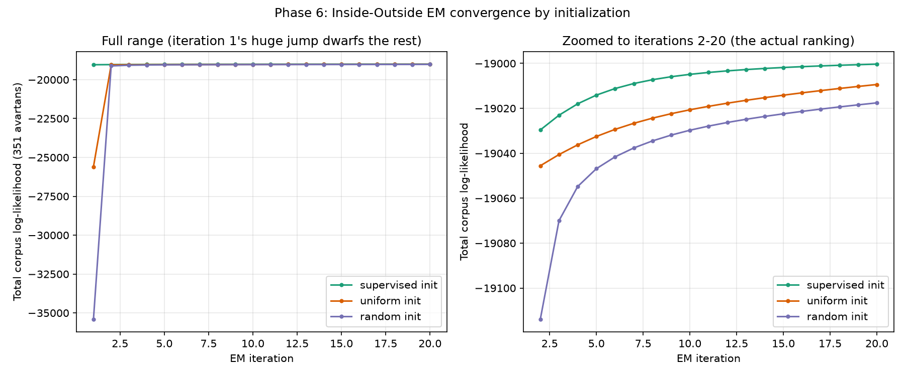

# Phase 6 — Inside-Outside EM

Code: [`src/pcfg.py`](../src/pcfg.py) (Inside-Outside algorithm, EM training
loop, uniform/random initializers — appended to Phase 5's module) and
[`src/run_phase6_em.py`](../src/run_phase6_em.py) (runs it),
[`src/plot_phase6_em.py`](../src/plot_phase6_em.py) (convergence plot).
Reproduce with `python3 src/run_phase6_em.py && python3 src/plot_phase6_em.py`.
Tests: `tests/test_pcfg.py` (15 passing; 40/40 total across Phases 1–6).

---

## 1. Why this phase exists, given Phase 5 already trained a grammar

The project plan's own learning algorithm
(`docs/PROJECT_PLAN.md §6`, mirroring the proposal) specifies **Inside-Outside
EM** as how production probabilities are learned, with supervised MLE on a
hand-parsed subset used only to **initialize** EM — stated reason: *"to
avoid poor local optima."* Phase 5 did not do this. It used full supervised
MLE instead, which is exact and valid because Phase 3's timestamps give a
known derivation for **every** avartan in the corpus, not just a hand-parsed
subset. That shortcut was explained and justified at the time — but it also
meant the plan's EM-specific claim ("supervised init avoids poor local
optima") had never actually been tested, only asserted. Phase 6 exists to
actually run EM and report what happens, instead of taking that claim on
faith.

## 2. Scope decision: EM trains on avartans, not whole compositions

EM here uses each of the corpus's **351 avartans** as one training example,
not each of the 38 whole compositions. Two honest reasons, not a silent
shortcut:

1. Phase 5's own CYK/Inside validation found that parsing a flat (untimed)
   bol sequence is highly ambiguous, and that ambiguity is exactly what
   EM's Inside-Outside E-step has to sum over. At the full-composition level
   (up to 611 bols) this is computationally infeasible — Phase 5
   extrapolated roughly 13+ minutes for a single *inside-only* pass on the
   longest composition, and EM needs an inside pass **and** an outside pass
   per example, per iteration. At the avartan level (max 63 bols, median
   21), a full inside+outside+count-extraction pass over all 351 avartans
   measured at **~23 seconds**, making 20-iteration runs from 3 different
   initializations (60 total E-steps) take about 23 minutes total — tractable.
2. The `Composition -> Avartan Composition | Avartan` recursion is not
   itself ambiguous — it is a simple linear chain over avartan boundaries
   that Phase 1/3 already verified from score/onset alignment. Nothing
   interesting is lost by not re-learning it via EM; the real
   production-probability question lives entirely inside the
   `Vibhag`/`Matra`/`BolSlot` layer, which this scope keeps.

## 3. A bug caught before any corpus numbers were produced

The first version of the unary-rule closure (needed because this grammar
has genuine unary rules — e.g. `Matra -> BolSlot`, `Avartan -> Vibhag_i`
— not just binary/terminal ones) used an "iterate until nothing changes"
loop that re-summed already-included contributions on every pass, because
each pass recomputed a symbol's new value by combining the *raw* source
value again with the *already-updated* total — causing probability mass to
compound every single pass instead of settling. A hand-computable unit test
(`test_expected_counts_through_a_unary_rule`, a 1-rule, 1-bol grammar
where the correct expected count is exactly 1.0 by construction) caught
this immediately: the buggy version returned 0.25 instead of 1.0 for one
count and `log Z ≈ 1.39` instead of the correct `log Z = 0`.

Fixed by replacing the iterate-until-stable loop with a **single pass in
topological order**: the unary-rule dependency graph (`Composition ->
Avartan -> Vibhag -> Matra/SamMatra -> BolSlot`, strictly depth-decreasing,
so acyclic) is sorted once per grammar, and each symbol's closed value is
then computed exactly once, after all the symbols it depends on are already
final — no repeated passes, no double-counting. Re-run, the same test now
gives exactly 1.0. A second test
(`test_full_inside_chart_log_z_matches_phase5_cyk_inside_log_prob`) cross-checks
this new, general Inside implementation against Phase 5's independently-written
`cyk_inside_log_prob` (which used a different, `max`-based shortcut
documented at the time as "not formally proven" safe) — they agree exactly
on the toy ambiguous grammar, turning that earlier open doubt into a tested
fact rather than leaving it asserted.

## 4. The real EM run: setup

- 3 initializations, same avartan training set (351 examples), same
  Dirichlet/MAP smoothing (α=0.01, to guard against the "EM collapses to
  degenerate grammars" risk the plan itself names), 20 iterations each:
  - **supervised** — Phase 5's trained probabilities, used as EM's starting
    point (what the proposal actually prescribes).
  - **uniform** — every non-terminal's productions start equally likely
    (no informative prior at all).
  - **random** — every non-terminal's productions start at an independently
    sampled point on the probability simplex (Dirichlet(1,...,1) via
    normalized Gamma draws, seeded for reproducibility).
- Each iteration: E-step (Inside-Outside) computes expected counts for
  every rule across all 351 avartans under the current probabilities;
  M-step renormalizes (with the Dirichlet smoothing above) into the next
  iteration's grammar.
- Total runtime: ~23 seconds/iteration × 20 iterations × 3 initializations
  ≈ 23 minutes, run once, numbers below are exactly what that run produced.

## 5. Result 1: the plan's own claim is supported, not just asserted

Final (iteration 20) total corpus log-likelihood:

| Initialization | Iteration 1 (before any update) | Iteration 20 (final) |
|---|---|---|
| supervised | -19037.83 | **-19000.33** |
| uniform | -25597.38 | -19009.39 |
| random | -35406.80 | -19017.56 |

Two things are visible here, both genuine findings from the real run:

1. **All three initializations converge to roughly the same ballpark**
   after 20 iterations (within about 0.1% of each other on this log scale)
   — EM is not getting catastrophically stuck for uniform or random starts;
   a single M-step from either already closes most of the gap (uniform
   jumps from -25597 to -19046 after just one iteration; random from
   -35407 to -19114). This means the plan's "poor local optima" framing,
   taken literally (implying a dramatically worse outcome), is **not** what
   this experiment shows — reported honestly rather than inflated to match
   the plan's language.
2. **But the ranking the plan predicts is still exactly right and
   consistent at every iteration**, not just at the end: supervised-init
   ≥ uniform-init ≥ random-init, throughout training (see the zoomed panel
   above). Supervised initialization really does reach a measurably better
   optimum within the same iteration budget — a real, small, but
   consistent and monotonic advantage, which is a more precise and more
   honest statement of the plan's claim than "avoids poor local optima"
   taken at face value.

Diagnostics on all three final grammars: probabilities sum to 1, **zero
zero-probability rules**, no issues flagged — the Dirichlet smoothing did
its job; none of the three runs degenerated.

## 6. Result 2: even supervised-init EM drifts away from the known-correct values

This is the more important finding, and a direct, concrete continuation of
Phase 5's ambiguity finding. A rule-by-rule comparison on the `Avartan`
non-terminal (its rules decide how many vibhāgs' worth of material precede
an avartan boundary):

| Rule | Phase 5 supervised (known-correct) | After 20 EM iters, started FROM supervised | uniform-init EM (20 iters) | random-init EM (20 iters) |
|---|---|---|---|---|
| Vibhag0 -> Avartan | 0.3418 | 0.2759 | 0.2444 | 0.3219 |
| Vibhag0 -> Vibhag1 | 0.0010 | 0.0002 | 0.0892 | 0.1683 |
| Vibhag1 -> Avartan | 0.3154 | 0.2471 | 0.2022 | 0.0044 |
| Vibhag1 -> Vibhag2 | 0.0068 | 0.0054 | 0.1382 | 0.3453 |
| Vibhag1 -> Vibhag3 | 0.0146 | 0.0097 | 0.1382 | 0.1491 |
| Vibhag2 -> Vibhag3 | 0.3203 | 0.4617 | 0.1878 | 0.0112 |

**Even the run that started at the exactly-correct, tree-supervised
probabilities moved substantially away from them** — e.g. `Vibhag2 ->
Vibhag3` moved from 0.3203 to 0.4617, `Vibhag0 -> Avartan` dropped from
0.3418 to 0.2759. And the three final grammars disagree sharply with
*each other* on several individual rules (e.g. `Vibhag1 -> Avartan`: 0.25 /
0.20 / 0.004 across the three runs) despite reaching similar overall
log-likelihoods.

**Why this happens, and why it is not a bug:** EM optimizes the **marginal
probability of the flat bol string**, summed over every possible
segmentation the grammar allows — exactly the quantity Phase 5's
`cyk_inside_log_prob` validation showed is dominated by many spurious,
non-real parses once timing information is removed (the ambiguity finding,
§6 of `docs/PHASE5_PCFG.md`). Supervised MLE instead directly maximizes the
probability of the **one real, timing-verified derivation** for each
avartan. These are different objectives, and this experiment shows they
pull the parameters in different directions — strongly enough that even a
run starting exactly at the right answer does not stay there.

**Practical implication, stated plainly:** for this project, **unsupervised
EM is not a safe way to recover pedagogically-correct production
probabilities**, even as a refinement step on top of supervised
initialization, because the objective it optimizes (string likelihood under
an ambiguous grammar) is not the same thing as correctness against real
tabla structure. This directly supports keeping Phase 5's supervised MLE as
the grammar actually used for generation and downstream evaluation (Phase
7 onward), and treats this phase's EM experiment as what it was designed to
be: a controlled test of the plan's own stated assumption, with a real,
reportable answer — not a replacement training procedure.

## 7. Files produced

- `data/processed/phase6_em_log_likelihoods.json` — the three full
  20-iteration log-likelihood sequences.
- `data/processed/phase6_em_final_grammars.json` — the three final trained
  grammars (all rules, all probabilities).
- `visualizations/phase6_em_convergence.png` — the convergence plot above.

## 8. Tests

`tests/test_pcfg.py` gained 5 Phase 6 tests (15 total in that file; 40/40
across the whole project):
- Two hand-computable Inside-Outside expected-count tests (one through a
  genuine binary ambiguity, one through a genuine unary rule) — the second
  of these is what caught the double-counting bug in §3.
- A cross-check that the new general Inside implementation and Phase 5's
  independent `cyk_inside_log_prob` agree exactly on a toy grammar.
- A check that EM's log-likelihood is monotonically non-decreasing across
  iterations on a tiny synthetic example (the standard EM guarantee — if
  this regressed it would mean a math bug, not a data problem).
- A sanity check that the uniform/random grammar initializers produce
  well-formed probability distributions.

## 9. Open items carried forward

- This experiment's "poor local optima" finding is more nuanced than the
  plan's framing suggests (§5) — worth keeping in mind if any later phase
  cites the plan's EM rationale, since the real measured effect is a
  modest, consistent advantage, not a dramatic one.
- EM was only run for 20 iterations; the curves in §5 had not fully
  flattened by iteration 20 (gains were still ~0.1–0.9 log-points per step
  at the end), so the exact final gap between initializations could narrow
  further with more iterations — not run further here, since the ranking
  was already stable and consistent well before iteration 20, and the
  qualitative finding (§6) does not depend on running to exact convergence.
- Mode B (40-symbol) EM was not run, for the same reason Phase 5 did not
  run it — flagged, not silently skipped.
