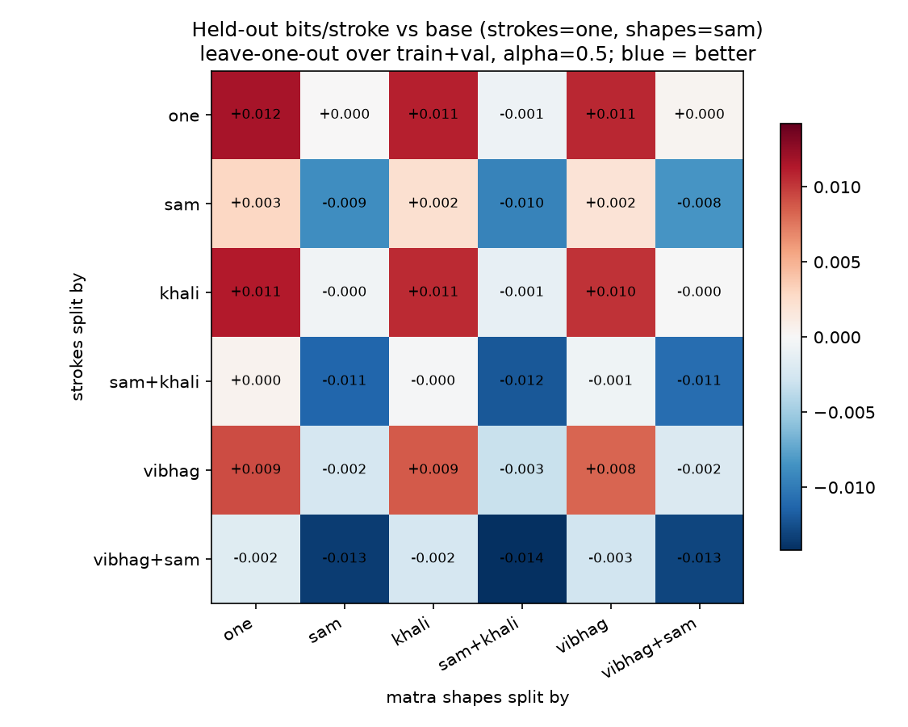

# Phase 8 — Structural Priors (Parameter Tying) and Ablations

Code: [`src/tying.py`](../src/tying.py) (tied-parameter model, held-out
evaluation, bootstrap), [`src/run_phase8_priors.py`](../src/run_phase8_priors.py)
(everything below), plus an opt-in `tail_labels` option in
[`src/pcfg.py`](../src/pcfg.py). Reproduce with
`python3 src/run_phase8_priors.py`. Tests: `tests/test_tying.py` (9 passing;
61/61 total across Phases 1–8).

All numbers below are copied from that script's output.

---

## 1. What this phase is for

The plan (`docs/PROJECT_PLAN.md` §6) asks for "aggressive parameter tying
across structurally analogous rules", for two reasons: there is little data
(38 compositions), and "a tied parameter is a measurable claim about style".
So the question here is: **which positions in the tāla cycle need their own
probabilities, and which can share?** Each answer is tested by how well the
grammar predicts compositions it was not trained on, not asserted.

## 2. Ground rules

- **The test split is not touched.** Phase 1 fixed a 26 / 6 / 6
  train / validation / test split. Everything here uses only the 32
  train + validation compositions, so choosing a tie cannot leak into
  Phase 11's grammar-vs-baseline comparison on the 6 test compositions.
- **Evaluation:** leave-one-out over 31 units (each composition held out in
  turn; `ajr_10_ajr` and `ajr_10_dli` are held out together, per Phase 1
  §10). That covers 7,351 strokes and 319 cycles. The score is **held-out
  bits per stroke**: the information the model needs to describe a held-out
  composition, divided by its number of strokes. Lower is better.
- **Real compositions are scored using their known structure** (Phase 3
  timing), as Phase 5 recommended, not with the ambiguous parser.
- **Uncertainty:** each comparison has a paired 95% bootstrap interval,
  resampling compositions (2,000 resamples). An effect is called real only
  if its interval excludes 0.
- **Positions are only the ones Phase 3 already grounds:** sam, the khālī
  vibhāg, and the vibhāg index. No claim is encoded about which strokes
  belong where; the held-out data decides.

## 3. The `MatraTail` fix (Phase 7's open item)

A mātrā's list of strokes now continues under its own label
(`Matra -> BolSlot MatraTail`), so "how many strokes / is it empty" and
"does the list continue" stop sharing one set of probabilities. This is
opt-in (`tail_labels=True`), like the rest symbol; the defaults still
reproduce the Phase 5 and Phase 7 grammars, and a test guards that.

| 2,000 constrained cycles | Empty mātrā | Mātrā with a rest mixed among strokes |
|---|---|---|
| Real data | 15.9% | 0 |
| Phase 7 grammar (no tails) | 10.0% | 1,876 |
| **With tails** | **15.8%** | **0** |

On held-out compositions it is also clearly better: **4.5391 vs 4.6663
bits/stroke, a difference of −0.127 [95% CI −0.169, −0.076]**. Rests plus
tails is the configuration used for everything below.

## 4. What the attribute layer saves

The plain context-free grammar can't count, so it pays to describe the cycle
structure every time: 9 choices at probability ⅓ and 6 at ⅔, which is
**17.774 bits per cycle**. Every real cycle has the same structure, so that
number is exact. With the attribute layer that structure is certain and
costs nothing. A test confirms this: the tied model's score equals
`pcfg.tree_log_prob` minus exactly 17.774 bits per cycle, for every
composition.

On held-out data: **4.5391 bits/stroke with the attribute layer, against
5.3104 for the plain grammar, a saving of 0.771 bits/stroke (about 15%)**.
This is the largest single effect in this phase, and it belongs in Phase
11's story: duration constraints are not only about correctness, they make
the model a better predictor.

## 5. The tying grid

Two tables are tied or split independently:
- **Strokes:** which bol is played.
- **Shapes:** whether a mātrā is empty, has one stroke, or more, and whether
  its stroke list continues.

Each can be split six ways: one shared table; sam vs the rest; khālī vs
bharī; sam / khālī / bharī; by vibhāg; or by vibhāg with sam separate. That
gives 36 variants in all. The base, which is the Phase 7 grammar plus tails,
uses one stroke table and splits shapes by sam (24 free parameters).

Held-out bits/stroke at α = 0.5 (rows: strokes split by; columns: shapes
split by):

| | one | sam | khali | sam+khali | vibhag | vibhag+sam |
|---|---|---|---|---|---|---|
| **one** | 4.5508 | *4.5391* | 4.5502 | 4.5384 | 4.5498 | 4.5395 |
| **sam** | 4.5420 | 4.5303 | 4.5414 | 4.5296 | 4.5410 | 4.5307 |
| **khali** | 4.5503 | 4.5387 | 4.5497 | 4.5379 | 4.5493 | 4.5390 |
| **sam+khali** | 4.5396 | 4.5279 | 4.5390 | 4.5271 | 4.5386 | 4.5283 |
| **vibhag** | 4.5484 | 4.5367 | 4.5478 | 4.5360 | 4.5474 | 4.5371 |
| **vibhag+sam** | 4.5374 | 4.5257 | 4.5368 | **4.5249** | 4.5364 | 4.5261 |

The same cell is best at every smoothing strength tried (α = 0.1, 0.5 and
1.0; all three grids are in the run output and `phase8_results.json`). The
pattern does not depend on α.

### 5.1 Each split against the base, with uncertainty

| Change from base | Free params | Δ bits/stroke | 95% CI | Real? |
|---|---|---|---|---|
| Strokes split by sam | 41 | −0.0088 | [−0.0162, −0.0005] | yes, weak |
| Strokes split by khālī | 41 | −0.0005 | [−0.0046, +0.0041] | no |
| Strokes split by sam + khālī | 58 | −0.0112 | [−0.0219, −0.0003] | yes, weak |
| Strokes split by vibhāg | 75 | −0.0024 | [−0.0169, +0.0113] | no |
| Strokes split by vibhāg + sam | 92 | −0.0134 | [−0.0326, +0.0052] | no |
| Shapes fully shared (sam merged in) | 21 | **+0.0117** | [+0.0059, +0.0175] | yes: worse |
| Shapes split by khālī (sam merged in) | 24 | +0.0111 | [+0.0046, +0.0178] | yes: worse |
| Shapes split by sam + khālī | 27 | −0.0007 | [−0.0031, +0.0013] | no |
| Shapes split by vibhāg (sam merged in) | 30 | +0.0107 | [+0.0042, +0.0180] | yes: worse |
| Shapes split by vibhāg + sam | 33 | +0.0004 | [−0.0021, +0.0032] | no |
| Best cell in the grid | 95 | −0.0142 | [−0.0339, +0.0048] | no |

What this says, plainly:

1. **Sam is the one position that measurably behaves differently.**
   - *Shapes:* every variant that merges sam with the other mātrā is worse,
     by about +0.011 bits/stroke, with intervals well clear of 0. Sam's
     mātrā have a different stroke-count pattern.
   - *Strokes:* giving sam its own stroke table helps a little (−0.009). The
     interval only just excludes 0, so treat this as weak.
   - Descriptively (fit on all 32 compositions), DHA is **2.25×** more
     common on sam than overall.
2. **The khālī vibhāg shows no measurable difference in this corpus,**
   neither in which strokes are played (−0.0005, interval centred on 0) nor
   in mātrā shapes (−0.0007). The plan (§4) expects khālī to differ (bass
   suppressed). At this level of representation, the data doesn't show it.
   This phase can't say why. Untested possibilities: these are solo
   compositions, not ṭhekā; vibhāg boundaries come from Phase 3's
   equal-mātrā assumption (§2.3 of the Phase 7 report); and the 18-symbol
   vocabulary may hide the bass/treble distinction. The direct test, which
   splits compound bols into bass and treble parts, is still the open
   Phase 2 question, because it needs a cited source.
3. **Per-vibhāg splits don't help reliably.** They add 50 or more
   parameters without a gain the data can confirm.
4. **All tying effects are small**, under 0.3% of the ~4.54 bits/stroke,
   against 15% for the attribute layer (§4) and 2.8% for tails (§3).
5. **A caution on multiple tests:** ten comparisons were made, and the two
   stroke-side "yes, weak" results only just exclude 0. With that many
   tests, one such result could appear by chance. The shape-side sam result
   is the robust one.

## 6. Soft tying

Instead of all-or-nothing sharing, each group's table can be pulled
partway toward the shared table, with strength β (β = 0 is the full split;
very large β is fully shared). Applied to the best grid cell:

| β | bits/stroke | vs full split |
|---|---|---|
| 1 | 4.5249 | +0.0000 [−0.0000, +0.0000] |
| 10 | 4.5250 | +0.0001 [−0.0001, +0.0003] |
| 100 | 4.5257 | +0.0008 [−0.0009, +0.0024] |
| 1,000 | 4.5312 | +0.0063 [−0.0028, +0.0150] |
| 10,000 | 4.5448 | +0.0199 [+0.0022, +0.0369] |

**Partial sharing gives no benefit here.** Light shrinkage changes nothing,
and heavy shrinkage only makes things worse. At large β, the shape tables
also get pulled toward a table that merges sam, which §5.1 shows is
harmful.

A problem caught along the way: my first soft-tying formula left out the
usual smoothing term. That made a stroke never seen in a group almost
impossible (about 1/1,500 of its shared-table probability), so even light
sharing scored worse than both extremes. It was fixed so that β = 0 equals
the full split exactly, and a test checks both limits. Only the fixed
version's numbers are reported above.

## 7. Recommendation, fixed now, before the test set is opened

The grammar for Phase 11 is chosen by this rule: **the simplest variant
whose improvement over the base has an interval excluding 0.** That is:

> **rests + tails, strokes split by sam, shapes split by sam** —
> 41 free parameters, 4.5303 held-out bits/stroke.

The best grid cell (95 parameters, 4.5249) is not chosen, because its gain
over the base is not distinguishable from 0. Fixing this choice here,
before any test-set number exists, is the point. If you'd rather keep the
base (24 parameters, since the stroke-side sam gain is weak), say so before
Phase 11.

## 8. Notes for Phases 10 and 11

- **What is predicted must be matched across models.** The ~4.54
  bits/stroke here counts the strokes *and* their placement (empty mātrā,
  strokes per mātrā). An n-gram, LSTM or Transformer over the bare bol
  string predicts strokes only. Phase 10 must decide whether baselines also
  predict timing, or whether the grammar is scored on strokes alone, before
  any comparison is meaningful.
- These are leave-one-out numbers on train + validation, **not** the RQ1
  result. That comes from the untouched test split in Phase 11.

## 9. Files and tests

- `data/processed/phase8_results.json`: every number above, including all
  three α grids.
- `visualizations/phase8_tying_grid.png`: the grid figure.

`tests/test_tying.py` (9 tests):
- Tail-label chain shape.
- Events counted by hand, with and without tails.
- Smoothed tables sum to 1; soft tying at β = 0 equals the full split, and
  at large β equals the shared table.
- Leave-one-out never trains on the held-out unit (a never-seen stroke gets
  exactly the smoothed unseen probability).
- Identical models give a zero bootstrap difference.
- The tied model equals `pcfg.tree_log_prob` minus exactly 17.774 bits per
  cycle on every real composition.
- The default grammars are unchanged (44 rules; 38 with rests).

## 10. Open items

1. **Confirm the Phase 11 grammar choice (§7).**
2. **Matched prediction target for the baselines (§8).** This is a Phase 10
   design decision; I'll propose options there.
3. **Still open from earlier phases:** the Phase 3 correction note; whether
   gapless tihāīs count; an expert check of `ben_23` and `ben_25`; mukh /
   palṭā; the 40-symbol vocabulary; and the bass/treble split of compound
   bols, which §5.1 shows is now the direct way to test the khālī
   expectation.
