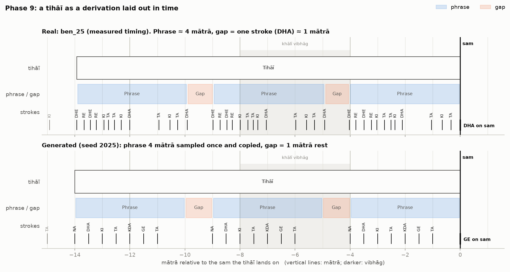
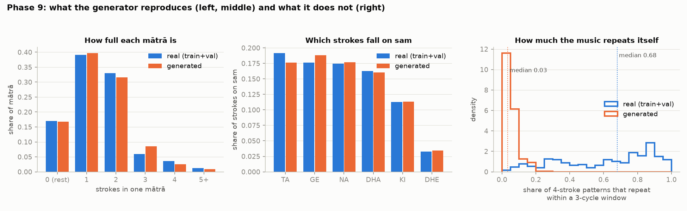

# Phase 9 — Generation Examples and Visualizations

Code: [`src/run_phase9_generation.py`](../src/run_phase9_generation.py), plus
an opt-in `sam_strokes` option in [`src/pcfg.py`](../src/pcfg.py). Reproduce
with `python3 src/run_phase9_generation.py`. Tests:
`tests/test_generation.py` (4 passing; 65/65 total across Phases 1–9).

All numbers below are copied from that script's output.

---

## 1. The grammar used

This is exactly the grammar fixed in Phase 8 §7: rests, tail labels, sam
with its own stroke table, and sam with its own mātrā-shape table. It is
**trained on the 32 train + validation compositions only**; the 6 test
compositions are still untouched. The result has 13 non-terminals and 58
rules, and its probabilities sum to 1 for every non-terminal.

A test confirms this grammar *is* the model Phase 8 selected. On every real
composition, its log-probability equals the Phase 8 tied model's minus
exactly the 17.774-bit-per-cycle structure cost (Phase 8 §4).

## 2. Twenty example compositions

Seeds 0–19 each give: 2 cycles from the grammar, then a tihāī cycle, then
the closing sam. Each is checked with the same `check_tihai` used on real
data: **20/20 pass every check.** The body cycles are well-formed, and each
tihāī is evenly spaced, lands exactly on sam, and has a gap from the plan's
set.

Each example is stored three ways:
- `data/processed/phase9_examples.json`: timeline (token, start, duration),
  the full annotated derivation tree, and the production history (rule
  sequence). This is the "sequence + explanation together" the plan asks
  for.
- `data/processed/phase9_examples.txt`: one readable line per cycle.
- The figures below.

Seed 0 in the text format (`[ ]` is one mātrā, `|` a vibhāg boundary, `X`
sam, `-` a rest; `tok(o,d)` marks a token that starts `o` mātrā into its
mātrā and lasts `d`, shown only inside the tihāī where the equal split
does not apply):

```
cycle 1: X[GE NA] [KI] [-] [NA] | [-] [-] [-] [TA GE] | [DHIN NA] [NA] [-] [KI] | [KI] [DHA] [-] [TA DHI]
cycle 2: X[TA TA] [-] [GE DHA] [TA] | [KI NA] [-] [-] [NA NA] | [DHE KI] [-] [GE] [GE TA TA NA] | [TA NA] [TIN GE] [GE KI] [RE]
cycle 3: X[TA KI] [-] [TA] [TA GE] | [KI DIN] [DIN NA] [NA] [TA DHA] | [TRA] [TA DIN] [-] [KI TA] | [TA NA NA] [-(0,1/2) TA(1/2,1/3) NA(5/6,1/3)] [NA(1/6,1/3) -] [TA NA NA]
cycle 4: X[NA]
```

The tihāī here is `TA NA NA` (1 mātrā), a ½-mātrā rest, the same phrase,
another rest, the same phrase, with the stroke after it (`NA`) on the sam
that opens cycle 4.

## 3. The explanation view: a real tihāī next to a generated one



**How to read it:** the horizontal axis is time in mātrā, counted back from
the sam the tihāī lands on. Each row is one level of the derivation tree:
the whole tihāī, then its phrases and gaps, then the individual strokes.
Every box spans exactly the time its node covers, so the tree *is* the
timeline. Thin lines are mātrā, darker lines are vibhāg boundaries, and the
khālī vibhāg is shaded.

- **Top (real, `ben_25`, measured timing):** phrase
  `DHE RE DHE RE KI TA TA KA DHA TA KI TA` (4.01 mātrā), gap `DHA` (0.95
  mātrā). The stroke after the third phrase falls **0.000 mātrā** from sam,
  to three decimals. This is the cleanest formal tihāī Phase 7 found, and
  it still needs an expert to confirm it musically.
- **Bottom (generated, seed 2025):** the same shape (phrase 4 mātrā, gap 1
  mātrā), with the phrase `NA DHA KI TA KDA GE TA` sampled once and copied
  twice. It lands exactly on sam by construction, and the independent check
  agrees.

What the comparison shows honestly:
- **The arithmetic skeleton matches:** three equal phrases and two equal
  gaps, resolving on sam.
- **The content does not.** The real gap is a stroke (`DHA`); the
  generator's gaps are always rests (a Phase 7 simplification). The real
  phrase is dense and internally patterned (`DHE RE DHE RE …`); the
  generated one is a looser string of strokes. §4 measures this difference.

## 4. What the generator reproduces, and what it does not



400 generated 3-cycle stretches compared with the real train + validation
data:

| | Real | Generated |
|---|---|---|
| Mātrā with 0 / 1 / 2 / 3 / 4 / 5+ strokes | 0.170 / 0.391 / 0.330 / 0.060 / 0.036 / 0.013 | 0.167 / 0.397 / 0.316 / 0.086 / 0.025 / 0.009 |
| Share of sam strokes that are TA / GE / NA / DHA / KI / DHE | 0.191 / 0.176 / 0.174 / 0.162 / 0.113 / 0.032 | 0.176 / 0.188 / 0.177 / 0.160 / 0.114 / 0.034 |
| **Share of 4-stroke patterns that repeat within a 3-cycle window (median)** | **0.680** (255 windows) | **0.034** (400) |

- **Left and middle panels match closely, but that is expected, not an
  achievement.** These are exactly the quantities the grammar models, and it
  was trained on this same data. It is a check that sampling works, not
  evidence of musical quality.
- **The right panel is the honest headline.** In real compositions, a
  typical 3-cycle stretch reuses about **two thirds** of its 4-stroke
  patterns. In generated stretches it is about **3%**. Real tabla here is
  built from material that comes back; the grammar picks each stroke from
  its position alone, with no memory of what came before. Its only source
  of repetition is the tihāī copy, which Phase 7 enforces outside the
  grammar.

### What this means for the next phases

These are expectations, not results:

- **Phase 11 (RQ1, prediction):** n-gram and neural baselines can pick up
  this local repetition and the grammar cannot. My expectation is that the
  grammar, as it stands, will predict held-out compositions *worse* than
  those baselines. Phase 11 will measure this rather than assume it.
- **Phase 13 (Turing-style test):** the current output would probably be
  easy to tell apart from real compositions. That would make the test
  uninformative unless the generator improves first.
- **What could close the gap:** a production that reuses earlier material,
  "repeat or vary a phrase". That is exactly what the plan's kāydā
  vocabulary (mukh, palṭā, dohrā) describes. It connects directly to the
  Phase 4 open question about those categories, and to the plan's
  "repetition" parameter ties (§6). This phase does not build it. It is
  listed as an option below.

## 5. Files and tests

- `data/processed/phase9_examples.json`, `phase9_examples.txt`: the 20
  examples.
- `data/processed/phase9_summary.json`: every number above.
- `visualizations/phase9_tihai_real_vs_generated.png`,
  `phase9_generated_vs_real_stats.png`.

Figure colours come from the reference palette in the visualization
guidance (blue = real or phrase, orange = generated or gap). The pair was
checked for colour-blind safety with its validator, and every check passed.

`tests/test_generation.py` (4 tests):
- The repetition measure, checked by hand.
- `sam_strokes` relabels only sam-mātrā strokes, and the Phase 5 default is
  unchanged.
- The generation grammar equals the Phase 8-selected model, up to the
  exact structure cost.
- Generated examples pass the tihāī check, and their text notation has one
  line per cycle with sam first.

## 6. Open items

1. **Repetition mechanism (§4).** Adding a "repeat / vary an earlier
   phrase" production is the most direct way to make generated output
   resemble real compositions. It would be new grammar structure, so it is
   your call whether to add it before Phase 10/11 (which would change what
   is compared) or after (and report the current grammar's numbers first).
2. **Matched prediction target for baselines** (from Phase 8 §8): decided
   in Phase 10.
3. **Still open from earlier phases:** the Phase 3 correction note; whether
   gapless tihāīs count; an expert check of `ben_23` and `ben_25`; mukh /
   palṭā; the 40-symbol vocabulary; and the bass/treble split of compound
   bols.
